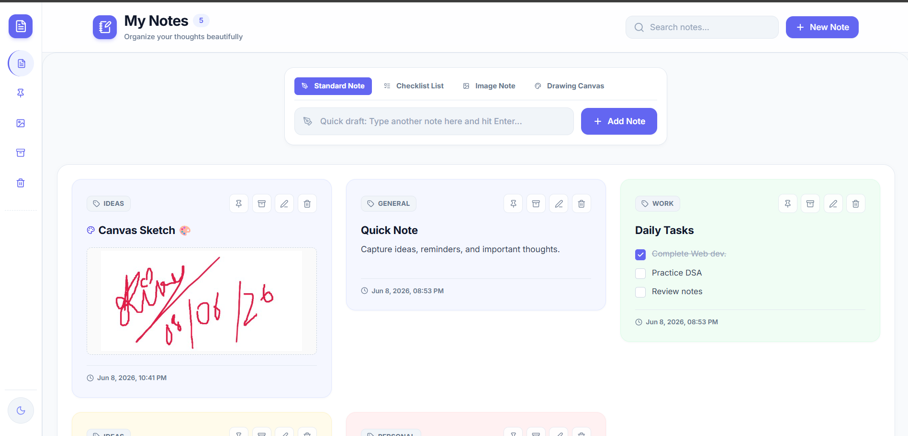
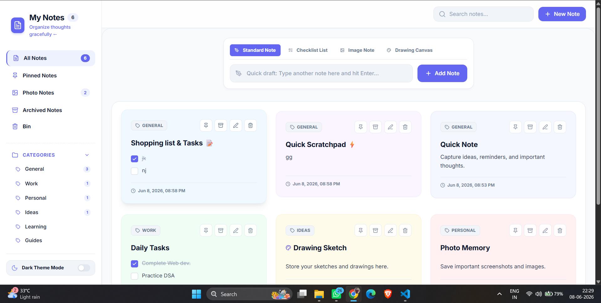
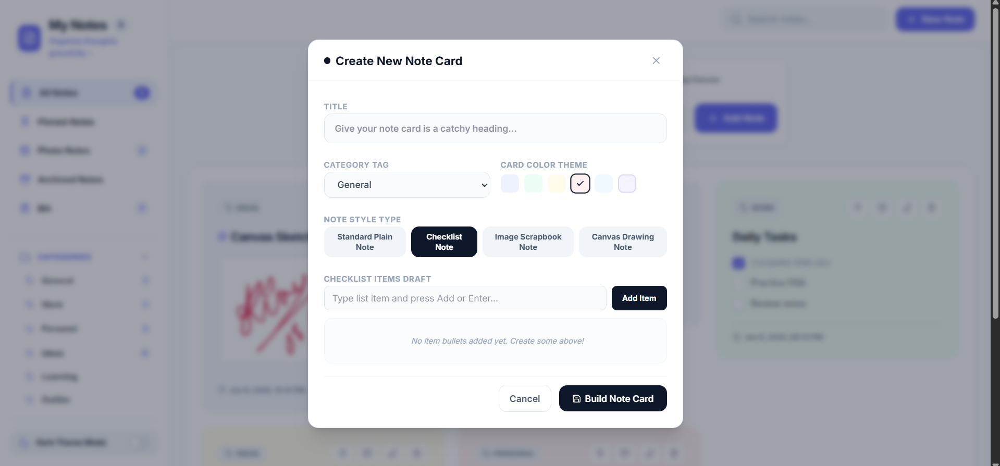
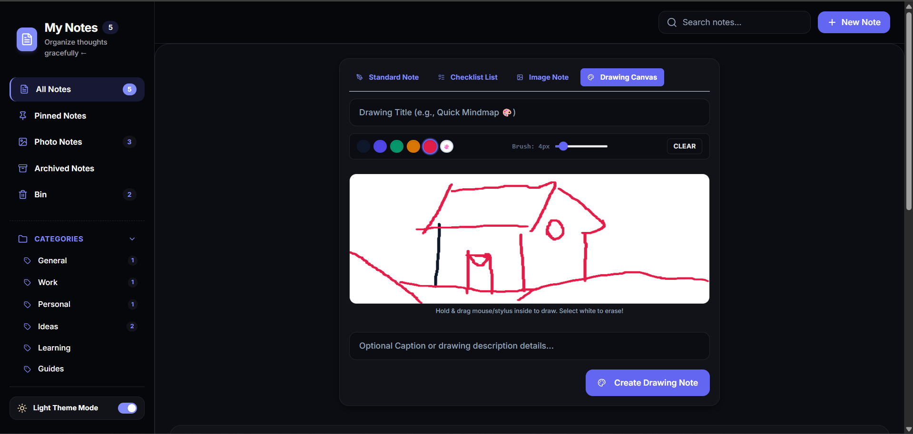
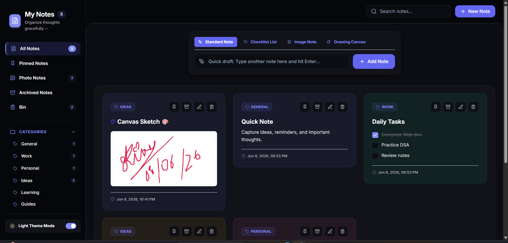
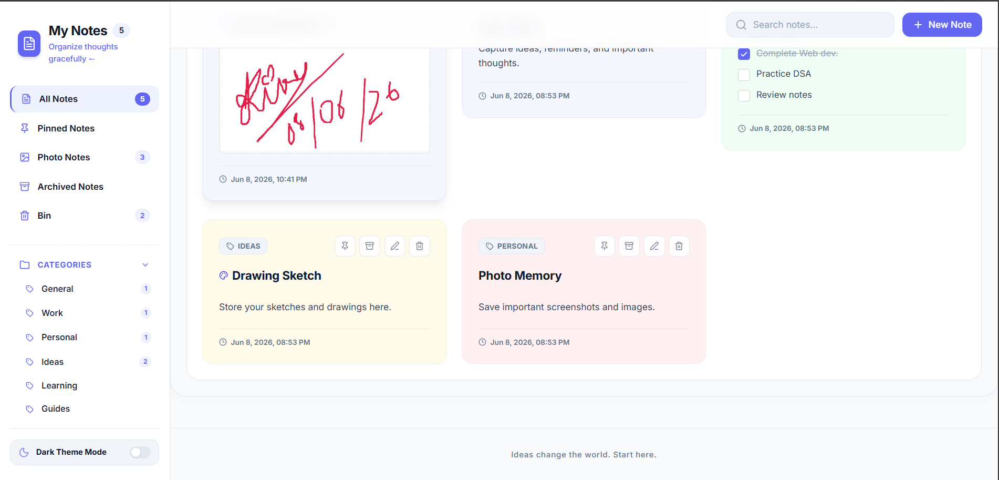

# 📝 Syntecxhub Notes App

**A modern, responsive Notes Application built with React + Vite**

 

[🌐 Live Demo](https://syntecxhub-notes-app.netlify.app/) &nbsp;·&nbsp; [📂 Repository](https://github.com/ItsRiku237/Syntecxhub_Notes_App) &nbsp;·&nbsp; [🐛 Report Bug](https://github.com/ItsRiku237/Syntecxhub_Notes_App/issues) &nbsp;·&nbsp; [✨ Request Feature](https://github.com/ItsRiku237/Syntecxhub_Notes_App/issues)

---

## 🖼 App Screenshots

### 🏠 Home Page

### 🧭 Sidebar Navigation with Home

### ➕ Add Note

### 🎨 Drawing Notes

### 🌙 Dark Mode

### 📂 Sidebar with Footer

---

## 📖 Table of Contents

- [About the Project](#-about-the-project)
- [Features](#-features)
- [Tech Stack](#-tech-stack)
- [Project Structure](#-project-structure)
- [Components Overview](#-components-overview)
- [Getting Started](#-getting-started)
- [Usage](#-usage)
- [Future Improvements](#-future-improvements)
- [Developer](#-developer)
- [Acknowledgements](#-acknowledgements)

---

## 🎯 About the Project

Syntecxhub Notes App is a feature-rich, responsive web application for creating, organizing, and managing notes right in your browser. Built during the **Syntecxhub Web Development Internship**, it demonstrates real-world React development — from component architecture to local state persistence.

The app supports **multiple note types** (Standard, Checklist, Image, Drawing), **category organization**, **pinned notes**, **dark mode**, and a **search interface** — all without any backend.

> 💾 Notes are saved using **localStorage** — they persist across page refreshes but are stored per browser/device.

---

## ✨ Features

| Feature | Description |
|--------|-------------|
| ➕ Create Notes | Quick-draft input with `+ New Note` button |
| ✏️ Edit Notes | Inline editing for any existing note |
| 🗑️ Delete & Bin | Delete notes with a recoverable Bin section |
| 📌 Pin Notes | Pin important notes to keep them at the top |
| 📋 Note Types | Standard Note, Checklist List, Image Note, Drawing Canvas |
| 🏷️ Categories | Organize by General, Work, Personal, Ideas, Learning, Guides |
| 🗃️ Archive | Archive notes to declutter without deleting |
| 🌙 Dark Mode | One-click dark/light theme toggle |
| 🔍 Search | Search bar to quickly find notes |
| 📱 Responsive | Works on desktop, tablet, and mobile |
| ⚡ Fast | Vite-powered build for near-instant performance |

---

## 🛠 Tech Stack

| Category        | Technology           |
|-----------------|----------------------|
| Frontend        | React.js (JSX)       |
| Build Tool      | Vite                 |
| Language        | JavaScript (ES6+)    |
| Styling         | CSS3 (per-component) |
| Icons           | Lucide React         |
| Storage         | Browser localStorage |
| Version Control | Git & GitHub         |
| Deployment      | Netlify              |

---

## 📁 Project Structure